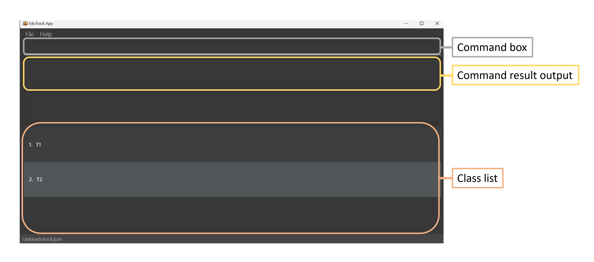
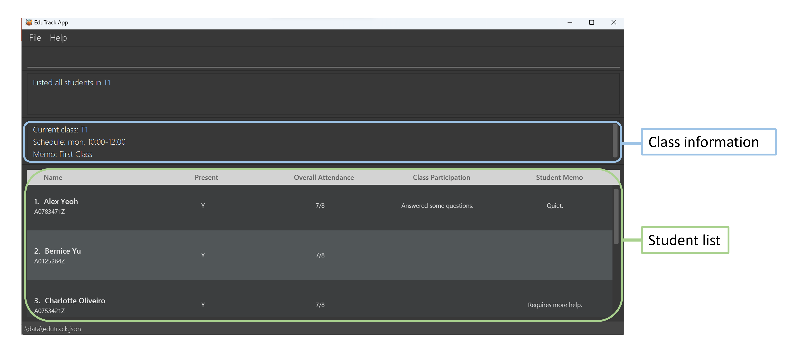
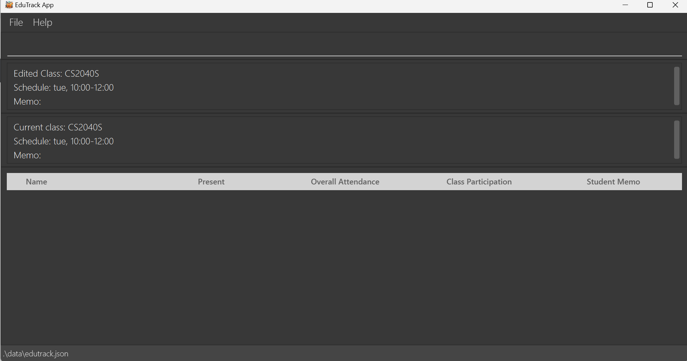
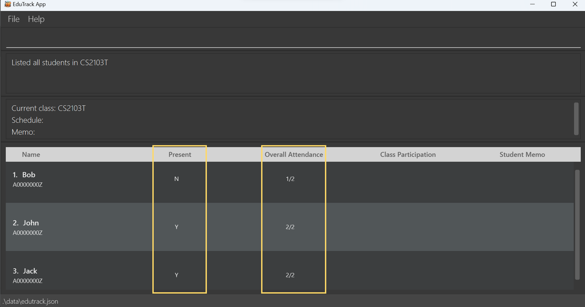
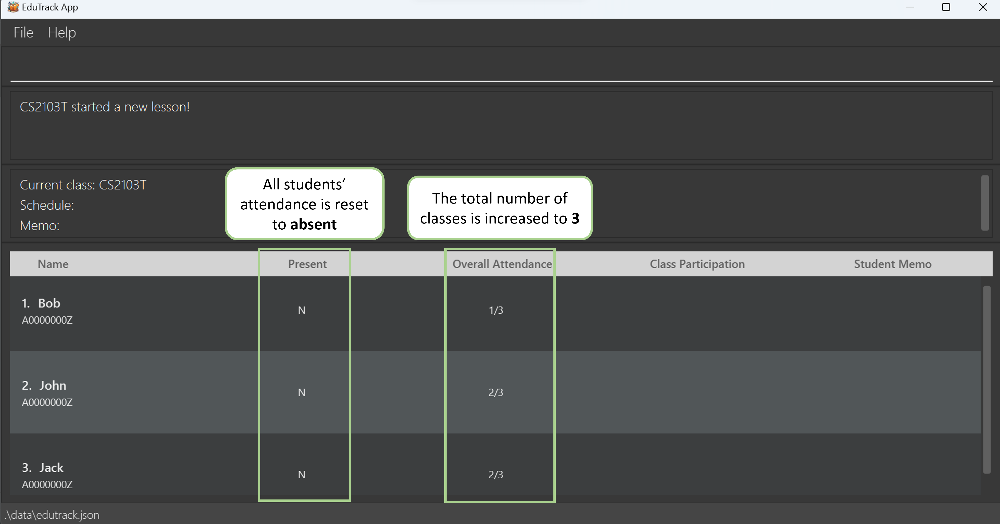
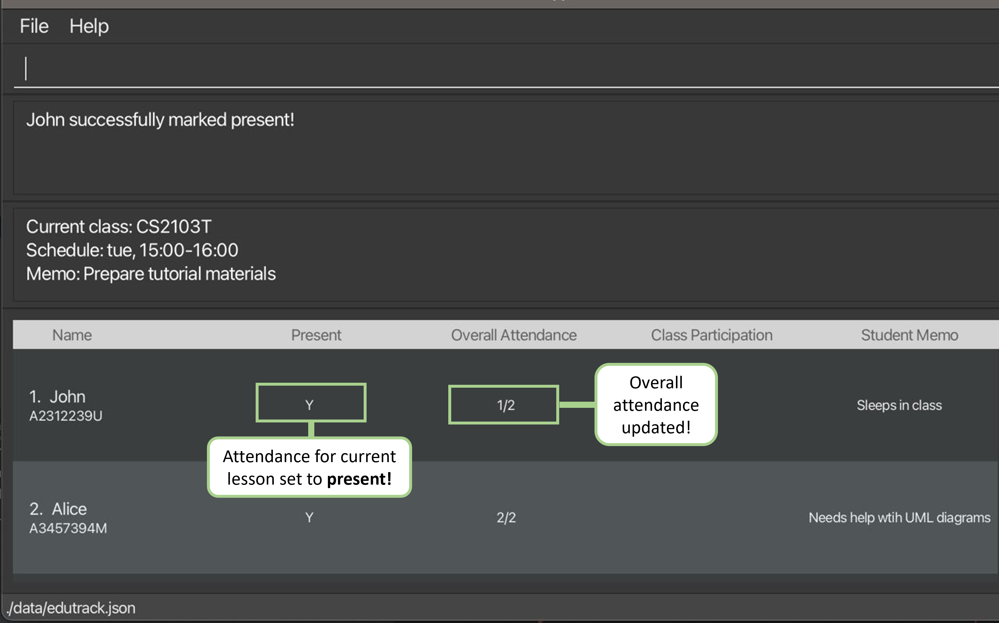
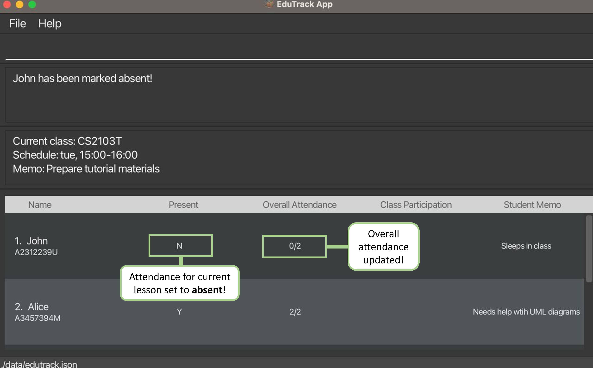
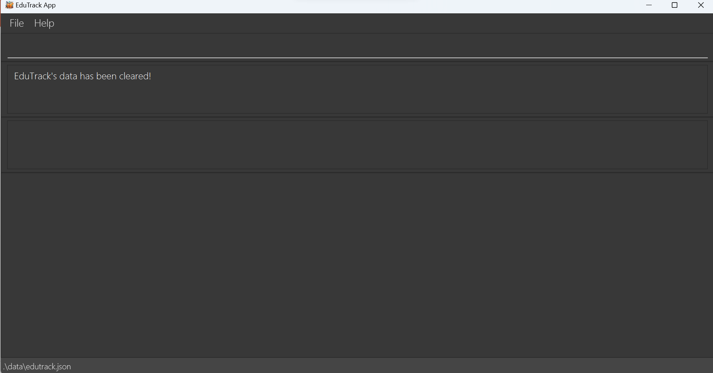

# EduTrack User Guide :book:

EduTrack is a **powerful desktop app designed for SOC tutors**, allowing you to streamline your teaching tasks and effortlessly track your student records. :sunglasses:

Whether you find yourself juggling the management of numerous students or simply require swift access to individual student information, EduTrack equips you with the tools to easily organize your classes.

The application is optimized for use via a Command Line Interface ([CLI](#glossary)) while still having the benefits of a Graphical User Interface ([GUI](#glossary)).

If you are **new** to this user guide, click [here](#about) to learn more.

If you are keen to get started on using EduTrack, click [here](#quick-start) to see the instructions on how to kickstart your EduTrack experience! :rocket:

If you are an **experienced user** of EduTrack, click [here](#command-summary) to see a summary of commands.

---

## Table of Contents

1. [Quick start](#quick-start)
2. [About](#about)
   - [EduTrack's Graphical User Interface](#edutrack-s-graphical-user-interface)
   - [Structure of this user guide](#structure-of-this-user-guide)
   - [Reading this user guide](#reading-this-user-guide)
     - [Common icons](#common-icons)
     - [Common terms](#common-terms)
     - [Command format](#command-format)
     - [Command parameters](#command-parameters)
3. [Features](#features)
   - [Class commands](#class-commands)
     - [Listing all classes : `list`](#listing-all-classes-list)
     - [Adding a class : `add /c`](#adding-a-class-add-c)
     - [Removing a class : `remove /c`](#removing-a-class-remove-c)
     - [Viewing a class : `view /c`](#viewing-a-class-view-c)
     - [Editing a class: `edit /c`](#editing-a-class-edit-c)
     - [Starting a lesson : `startlesson /c`](#starting-a-lesson-startlesson-c)
     - [Setting number of lessons of a class: `setlesson /c`](#setting-number-of-lessons-of-a-class-setlesson-c)
   - [Student commands](#student-commands)
     - [Adding a student : `add /s`](#adding-a-student-add-s)
     - [Removing a student : `remove /s`](#removing-a-student-remove-s)
     - [Editing a student : `edit /s`](#editing-a-student-edit-s)
     - [Marking a student present : `mark /s`](#marking-a-student-present-mark-s)
     - [Marking a student absent : `unmark /s`](#marking-a-student-absent-unmark-s)
     - [Marking all students in a class present : `markall /c`](#marking-all-students-in-a-class-present-markall-c)
     - [Marking all students in a class absent : `unmarkall /c`](#marking-all-students-in-a-class-absent-unmarkall-c)
   - [Miscellaneous commands](#miscellaneous-commands)
     - [Viewing help : `help`](#viewing-help-help)
     - [Exiting the program : `exit`](#exiting-the-program-exit)
     - [Clearing all entries : `clear`](#clearing-all-entries-clear)
     - [Saving the data](#saving-the-data)
4. [FAQ](#faq)
5. [Known issues](#known-issues)
6. [Command summary](#command-summary)
7. [Glossary](#glossary)

---

## Quick start

1. Ensure you have Java `11` or above installed on your computer.
2. Download the latest `EduTrack.jar` from [here](https://github.com/AY2324S1-CS2103T-T15-3/tp/releases).
3. Copy the file to the folder you want to use as the _home folder_ for your EduTrack.
4. Open a command terminal, `cd` into the folder you placed your `EduTrack.jar` file in, and type `java -jar EduTrack.jar` to run the application.<br>
   A GUI similar to the one below should appear in a few seconds. Note how the app contains some sample data. Refer to [EduTrack's Graphical User Interface](#edutrack-s-graphical-user-interface) if you want to learn more about EduTrack's interface.

 

<br>

5. Type the command in the command box and press `Enter` to execute it. eg. typing `help` and `Enter` again will open the help window.<br>
   Some example commands you can try:
   - `list` : Lists all classes.
   - `view /c 1` : Shows the class information and all students of the first class in the class list.
   - `add /c CS2103T` : Adds a class named "CS2103T" to the list of classes.
   - `add /s John /c 1` : Adds a student named "John" to the first class in the class list.
   - `remove /c 1` : Removes the first class in the class list.
   - `exit` : Exits the app.
6. Refer to the [Features](#features) for more details of each command.

---

## About

### EduTrack's Graphical User Interface

EduTrack's [GUI](#glossary) is designed with simplicity and efficiency in mind, featuring two primary displays:

1. **Overview of All Classes**

   - **Command box:** Where you can enter the commands.
   - **Command result output:** The resulting message will be shown here.
   - **Class list:** Displays the list of all your classes.



2. **Overview of A Specific Class**

   - **Class information:** Displays the details of your selected class.
   - **Student list:** Displays the list of all students in your selected class.



<box type="info">

**Information:**

* The `UI` will refresh upon any changes to the class list or student list.
* If changes are made to a student in another class while you are [viewing a class](#viewing-a-class--view-c), the `UI` will update to show you the other class' students.

</box>

### Structure of This User Guide

We understand that reading a new user guide can be overwhelming. That is why this user guide is structured to let you find what you need fast and easily. You can refer to the [Table of Contents](#table-of-contents) to jump to various sections of this user guide.

In the following [subsection](#reading-this-user-guide), you can find several tips that could be beneficial when reading this guide. The [next section](#features) documents the _main features_ that EduTrack offers and provides you with instructions on how to use them!

<br>

### Reading This User Guide

In this section, you will be provided with essential information to help you understand this user guide effectively.

#### Common icons
These are the common icons you will encounter throughout this user guide.

**Additional Information**<br>
The text displayed in an information box indicates additional details that you might find useful to know while using the commands.

<box type="info">

**Information:** Example additional information.

</box>

**Caution**<br>
The text displayed in a caution box indicates what should be followed carefully; otherwise, unintended consequences might arise.

<box type="warning">

**Caution:** Example warning.

</box>

**Tip**<br>
The text displayed in a tip box indicates handy tips to enhance your user experience with EduTrack.

<box type="tip">

**Tip:** Example tip.

</box>

#### Common terms

These are the common terms you will encounter throughout this user guide.

| Terms         | Meaning                                                                         |
|---------------|---------------------------------------------------------------------------------|
| **Command**   | The instruction you enter into the application.                                 |
| **Parameter** | The additional information you provide for the instruction you intend to enter. |

#### Command format

* Words in `UPPER_CASE` are **compulsory parameters** to be supplied.<br>

  E.g., you are to provide the `CLASS_NAME` in `add /c CLASS_NAME` command.

* Words in `UPPER_CASE` enclosed in square brackets are **optional parameters**. <br>
  
  E.g., you can choose to provide either `CLASS_NAME`, `MEMO`, and `SCHEDULE` in the `edit /c CLASS_INDEX [/n CLASS_NAME] [/m MEMO] [/t SCHEDULE]` command.

* **Optional parameters** can be in any order.<br>
  
  E.g., if the command specifies `[/n CLASS_NAME] [/m MEMO]`, you can choose to provide them in the following order:`[/m MEMO] [/n CLASS_NAME]`.

* Extraneous parameters for commands that do not take in parameters (such as `help`, `list`, `exit` and `clear`) will be
ignored.<br>

  E.g., you enter the command `help 123`, it will be interpreted as `help`.

* If you are using a **PDF version** of this document, be careful when copying and pasting commands that span multiple lines
as space characters surrounding line breaks may be omitted when copied over to the application.

#### Command parameters

Most commands in EduTrack require various parameters. You can find their constraints in the table below:

| Parameters              | Constraints                                                                                                                                                                                                                                             |
|-------------------------|---------------------------------------------------------------------------------------------------------------------------------------------------------------------------------------------------------------------------------------------------------|
| `CLASS_NAME`            | A single-word string consists of any characters and is not case-sensitive. <br> When `CLASS_NAME` is displayed on the screen, it will always be in uppercase.                                                                                           |
| `CLASS_INDEX`           | A valid positive integer shown in displayed class list.                                                                                                                                                                                                 |
| `STUDENT_NAME`          | A string consisting of alphanumeric characters.                                                                                                                                                                                                         |
| `STUDENT_INDEX`         | A valid positive integer shown in displayed student list.                                                                                                                                                                                               |
| `MEMO`, `PARTICIPATION` | A string consisting of any characters.                                                                                                                                                                                                                  |
| `SCHEDULE`              | A string that follows the format `day, HH:MM-HH:MM`: <br> - `day` can be one of the following options: "mon", "tue", "wed", "thu", "fri" <br> - `HH:MM-HH:MM` signifies a 24-hour clock format, where the start time must be earlier than the end time. |
| `ID`                    | A string that starts with "A", followed by only numerical characters (0-9) and ends with a single capitalised alphabet (A-Z).                                                                                                                           |
| `NUMBER_OF_LESSONS`     | A non-negative integer.                                                                                                                                                                                                                                 |

<br>

:arrow_up: _Return to [Table of Contents](#table-of-contents)_ 

---

## Features

The features are broken down into the following subsections:

1. [Class commands](#class-commands)
2. [Student commands](#student-commands)
3. [Miscellaneous commands](#miscellaneous-commands)

We highly recommend you read the [Command format](#command-format) and [Command parameters](#command-parameters) sections to understand their constraints before using our features.

## Class commands :school:

### Listing all classes : `list`

Shows an overview of all your existing classes. You will be able to have a concise view of all the classes you are currently teaching.

**Command Format:** `list`

<br>

### Adding a class : `add /c`

Adds a new class to your list of classes. You can manage multiple classes at once with this feature.

**Command Format:** `add /c CLASS_NAME`

**Examples:**
* `add /c cs2103t` : Adds a new class named "CS2103T".
* `add /c st2334` : Adds a new class named "ST2334".

**Sample Usage:**

1. Assuming you want to add a new class named "CS2103T".
2. Enter the following command:

````
add /c cs2103t
````

3. The result box will display the following message:

````
CS2103T has been added
````

4. You have successfully added the class. :tada:

<br>

<box type="warning">

**Caution:**

* The `CLASS_NAME` provided must be **unique**, meaning that two classes with the same `CLASS_NAME` cannot coexist in EduTrack.

</box>

<br>

### Removing a class : `remove /c`

Removes an existing class from your list of classes.

**Command Format:** `remove /c CLASS_INDEX`

**Examples:**
* `remove /c 1` : Removes the first class in your class list.
* `remove /c 2` : Removes the second class in your class list.

**Sample Usage:**

1. Assuming you want to remove the third class named "CS2103T-T15-3" in the class list.
2. Enter the following command:

````
remove /c 3
````

3. The result box will display the following message:

````
Deleted Class: CS2103T-T15-3
````

4. You have successfully removed the class. :tada:

<br>

### Viewing a class : `view /c`

Shows you detailed information (class name, class schedule, enrolled student list) about a class on the User Interface. Using this command you will be able to have access to all the information you need to manage and edit your class and student information.

**Command Format:** `view /c CLASS_INDEX`

**Examples:**

- `view /c 1` : Shows information of your first class in the class list.
- `view /c 2` : Shows information of your second class in the class list.

**Sample Usage:**

1. Assuming you want to view the fifth class in the class list.
2. Enter the following command:

````
view /c 5
````

3. The result box will display the following message:

````
Listed all students in CS2103T-T15-3
````

4. You have successfully viewed the class. :tada:

<br>

### Editing a class : `edit /c`

Edits your class information at the specified index. You can update the name of your class, memo, and schedule. This helps to keep your class information up-to-date.

**Command Format:** `edit /c CLASS_INDEX [/n CLASS_NAME] [/m MEMO] [/t SCHEDULE]`

**Examples:**
* `edit /c 1 /n cs2100` : Edits the name of your class to "CS2100".
* `edit /c 1 /m submit attendance report /n cs2100` : Edits the name of your class to "CS2100" and its memo to "submit attendance report".
* `edit /c 1 /t mon, 10:00-12:00 /m` : Edits the schedule of your class to "mon, 10:00-12:00" and removes its memo.

**Sample Usage:**

1. Assuming you want to edit the name of the second class to "CS2040S".
2. You can enter `view /c 2` to see what your original class looks like, as shown below:

<br>


<br>

3. Enter the following command:

````
edit /c 2 /n cs2040s
````

4. The result box will display the following message:

<br>



<br>

5. You have successfully edited the name of your class. :tada:

<br>

<box type="info">

**Information:**

* You must specify **at least one** parameter of the following: `/n`, `/m`, `/t`.
* For each parameter specified, existing values will be updated to the input values.

</box>

<box type="warning">

**Caution:**

* The class to be edited must already exist.
* When editing the name of your class, ensure that the provided `CLASS_NAME` is unique.

</box>

<box type="tip">

**Tip:**

* To delete the memo or schedule of your class, you can type `/m` or `/t` without specifying anything after it.

</box>

<br>

### Starting a lesson : `startlesson /c`

Starts a lesson of your chosen class and enables you to start [attendance taking](#marking-a-student-present--mark-s).

**Command Format:** `startlesson /c CLASS_NAME`

**Example:**
- `startlesson /c CS2103T`: Increases the total number of lessons conducted for class "CS2103T" by 1 and marks all the students in "CS2103T" 
as absent for attendance taking.

**Sample Usage**:

1. Assuming you want to start a lesson for your "CS2103T" class, and the class index in the displayed list is "1".

2. Enter the following command:
```
startlesson /c CS2103T
```
3. You can enter `view /c 1` to see what your original class looks like, as shown below:



4. The result box will display the following message:



5. You have successfully started a lesson in "CS2103T". :tada:

<br>

<box type="info">

**Information:**
- Class must already exist
- The update of class records consists of increasing the number of lessons conducted in your class by 1 and marking all your students as absent to facilitate attendance marking.

</box>

<box type="tip">

**Tip:**

- You might find it helpful to use this command at the beginning of your class.
- If you started a lesson by accident, you can manually [set the number of lessons](#setting-number-of-lessons-of-a-class-setlesson-c) back.

</box>

<br>

### Setting the number of lessons of a class : `setlesson /c`

Sets the total number of lessons conducted for your chosen class manually.

**Command Format:** `setlesson /c CLASS_NAME /l NUMBER_OF_LESSONS`

**Examples:**
- `setlesson /c CS2103T /l 10` : Sets the total number of lessons of class "CS2103T" to "10".
- `setlesson /c CS2103T /l 0` : Sets the total number of lessons of class "CS2103T" to "0".

**Sample Usage:**

1. Assuming you want to set the number of lessons conducted for your class "CS2103T" to "5".

2. Enter the following command:
```
setlesson /c CS2103T /l 5
```
3. The result box will display the following message:
```
Successfully set the number of lessons in CS2103T to 5!
```
4. You have successfully set the total number of lessons in "CS2103T" to "5". :tada:

<br>

<box type="info">

**Information:**

- If one of your student's number of lessons attended <u>exceeds</u> the `NUMBER_OF_LESSONS`, it is automatically reduced to `NUMBER_OF_LESSONS`.
    - Example: John's current attendance in "CS2103T" is 5/7. <br> If you enter the command `setlesson /c CS2103T /l 3`, it will adjust John's attendance to 3/3.

</box>

<box type="tip">

**Tip:**

- You might find this command useful when you accidentally [start a lesson](#starting-a-lesson-startlesson-c) and need to revert the number of lesson(s).


</box>

<br>

:arrow_up: _Return to [Table of Contents](#table-of-contents)_

## Student commands :mortar_board:

### Adding a student : `add /s`

Adds a new student to your existing class.

**Command Format:** `add /s STUDENT_NAME /c CLASS_INDEX`

**Examples:**
* `add /s John /c 1` : Adds a new student named "John" into the first class on the displayed class list.
* `add /s Bob /c 2` : Adds a new student named "Bob" into the second class on the displayed class list.

**Sample Usage:**

1. Assuming you want to add a student named "John" into the class "CS2103T", and the class index in the displayed list is "1".
2. Enter the following commands:
````
list
add /s John /c 1
````
3. The result box will display the following message:
````
Added New Student: John; Id: A0000000Z; Memo:  to the class: CS2103T
````
4. You have successfully added the "John" into "CS2103T". :tada:

<br>

<box type="info">

**Information:**
* Every student must be assigned to a class, i.e. a student should always appear in one of the classes.
* A default id "A0000000Z" will be assigned to the student.
* An identical student (ie. all student information are the same) cannot be in more than one class at the same time.
  * These include the student's name, id, memo, participation, current attendance, and total attendance.

</box>

<box type="warning">

**Caution:**
* The class to add the student into must already exist.
* After adding the student, the `UI` will update to show you the student list of the class which you added the new student into.

</box>

<box type="tip">

**Tip:**
* If you want to see the student show up in the student list of the class, perform a [view command](#viewing-a-class-view-c) first. Be sure to remember the `CLASS_INDEX` though!
* You can edit the student's id using the [edit student command](#editing-a-student-edit-s) once you have added the student!
* You can also add the memo or class participation for a particular student using the same [edit student command](#editing-a-student-edit-s)!

</box>

<br>

### Removing a student : `remove /s`

Removes a student in your chosen class.

**Command Format:** `remove /s STUDENT_INDEX /c CLASS_NAME`

**Examples:**

- `remove /s 1 /c CS2103T` : Removes the first student in the class named "CS2103T".
- `remove /s 2 /c CS2100` : Removes the second student in the class named "CS2100".

**Sample Usage:**

1. You want to remove a student named "John" and he is the second student in the class named "CS2103T".
2. Enter the following command:
```
remove /s 2 /c CS2103T
```
3. The result box will display the following message:
```
John has been removed from CS2103T
```
4. You have successfully removed "John" from "CS2103T". :tada:

<br>

<box type="info">

**Information:**
- You can identify the `STUDENT_INDEX` of a student by using the [viewing a class](#viewing-a-class--view) command.

</box>

<br>

### Editing a student : `edit /s`

Edits an existing student from your specified class. You can edit your student's name, memo and participation. This will help to keep your student records up-to-date.

**Command Format:** `edit /s STUDENT_INDEX /c CLASS_NAME [/n STUDENT_NAME] [/id ID] [/m MEMO] [/p PARTICIPATION]`

**Examples:**
* `edit /s 1 /c CS2103T /n Bob`: Edits the name of the first student in the class "CS2103T" to "Bob".
* `edit /s 2 /c CS2103T /id A0231234U`: Edits the id of the second student in the class "CS2103T" to "A0231234U".

**Sample Usage:**

1. Assuming you want to edit the id of the second student to "A010193Z", who is from "CS2103T" class, and the class index in the displayed list is "1".
2. Enter the following commands:
```
view /c 1
edit /s 2 /c CS2103T /id A010193Z
```
3. The result box will display the following message:<br>


4. You have successfully edited your student's details. :tada:

<br>

<box type="info">

**Information:**

- Edits the student at the specified `STUDENT_INDEX` in the specified `CLASS_NAME`.
- At least one of the optional fields must be provided.
- Existing values will be updated to the input values. This means you can use the command to remove a student's memo or student's participation!

</box>

<box type="warning">

**Caution:**

- Only valid ids will be recognised. It has to start with "A", followed by only numerical characters (0-9), and end with a single capitalized alphabet (A-Z).
- After editing the student, the `UI` will update to show you the student list of the class that the edited student is in.
- Be careful of any unintended edits that might lead to unwanted results (eg. 2 students with the same name) as they will not be counted as identical students as mentioned in the `Adding a student feature`.


</box>

<br>

### Marking a student present : `mark /s`

Marks a student present for your current lesson.

**Command Format:** `mark /s STUDENT_INDEX /c CLASS_NAME`

**Examples:**
* `mark /s 2 /c CS2103T` : Marks the second student in your class "CS2103T" as present.
* `mark /s 3 /c CS2102` : Marks the third student in your class "CS2102" as present.

**Sample Usage:**

1. Assuming you want to mark the second student named "Jamie" in your class "CS2103T", whereby the class is positioned at index "1" in your class list, as present.
2. Enter the following commands:
```
view /c 1
mark /s 2 /c CS2103T
```

3. The result box will display the following message:
```
Jamie successfully marked present!
```

4. Below is a sample of the resulting outcome of the command:

<br>



<br>

5. You have successfully marked "Jamie" as present in "CS2103T". :tada:

<br>

<box type="info">

**Information:**

* `CLASS_NAME` must be the name of a class that already exists.

</box>

<box type="warning">

**Caution:**

* Your target student should not already be marked present.

</box>

<box type="tip">

**Tip:**

* If all your students are present, you can use our [markall](#marking-all-students-in-a-class-present-markall-c) command instead!

</box>

<br>

### Marking a student absent : `unmark /s`

Marks a student absent from your current lesson.

**Command Format:** `unmark /s STUDENT_INDEX /c CLASS_NAME`

**Examples:**
* `unmark /s 2 /c CS2103T` : Marks the second student in your class "CS2103T" as absent.
* `unmark /s 3 /c CS2102` : Marks the third student in your class "CS2102" as absent.

**Sample Usage:**

1. Assuming you want to mark the second student named "Jamie" in your class "CS2103T", whereby the class is positioned at index "1" in your class list, as absent.
2. Enter the following commands:
```
view /c 1
mark /s 2 /c CS2103T
```
3. The result box will display the following message:
```
Jamie has been marked absent!
```

4. Below is a sample of the result outcome:

<br>



<br>

5. You have successfully marked "Jamie" as absent in "CS2103T". :tada:

<br>

<box type="info">

**Information:**

* `CLASS_NAME` must be the name of a class that already exists.

</box>

<box type="warning">

**Caution:**

* Your target student should not already be marked absent.

</box>

<br>

### Marking all students in a class present : `markall /c`

Marks all the students in your class as present. You can use this command if all your students are present for your current lesson.

**Command Format:** `markall /c CLASS_INDEX`

**Examples:**
* `markall /c 1` : Marks all the students in your first class in the class list as present.
* `markall /c 2` : Marks all the students in your second class in the class list as present.

**Sample Usage:**

1. Assuming you want to mark all the students in your class named "CS2103T", whereby the class is positioned at index "1" in your class list, as present.
2. Enter the following commands:
```
view /c 1
markall /c 1
```
3. The result box will display the following message:
```
Successfully marked all students in CS2103T!
```
4. You have successfully marked all the students in "CS2103T" as present. :tada:

<box type="info">

**Information:**

* Students who have already been marked present will not be affected by this command.

</box>

<box type="tip">

**Tip:**

* You can use `markall` in conjunction with `unmark` if most of your students are present, you can save more time doing it this way.

</box>

<br>

### Marking all students in a class absent : `unmarkall /c`

Marks all students in your class as absent. You can use this command if all your students are absent for your current lesson.

**Command Format:** `unmarkall /c CLASS_INDEX`

**Examples:**
* `unmarkall /c 1` : Marks all the students in your first class in the class list as absent.
* `unmarkall /c 2` : Marks all the students in your second class in the class list as absent.

**Sample Usage:**

1. Assuming you want to mark all the students in your class named "CS2103T", whereby the class is positioned at index "1" in your class list, as absent.
2. Enter the following commands:
```
view /c 1
unmarkall /c 1
```
3. The result box will display the following message:
```
All students in class CS2103T have been marked present!
```
4. Successfully unmarked all students in "CS2103T"! :tada:

<box type="info">

**Information:**

* Students who have already been marked absent will not be affected by this command.

</box>

<br>

:arrow_up: _Return to [Table of Contents](#table-of-contents)_

## Miscellaneous commands 🛠️

### Viewing help : `help`

Displays a pop-up window containing the link to this user guide. You can use this command to quickly access the user guide.

**Command Format:** `help`

<box type="info">

**Information:**

- You will see the following box once you have successfully executed the command:

  

- To read the user guide, you can click on the "Copy URL" button and paste the link into your web browser.

</box>

<br>

### Exiting the program : `exit`

Exits the application at any time you want.

**Command Format:** `exit`

<br>

### Clearing all entries : `clear`

Removes all your entries from EduTrack when you want to start fresh.

**Command Format:** `clear`

<box type="info">

**Information:**

- EduTrack's UI should look like this when you have successfully executed the command:

  

</box>

<box type="warning">

**Caution:**

* Please ensure to think carefully before you execute this command as the action **cannot be undone**.

</box>

<br>

### Saving the data

EduTrack's got your back. Your data is automatically saved on your hard disk after any command that changes the data, so no need to worry about saving manually.

<br>

:arrow_up: _Return to [Table of Contents](#table-of-contents)_

---

## FAQ

**Q**: How do I transfer my data to another computer?<br>
**A**: Install the app on the other computer and overwrite the empty data file EduTrack creates, with the file
that contains the data of your previous EduTrack home folder.

**Q**: How do I save my data?<br>
**A**: EduTrack's data is saved in the hard disk automatically after any command that changes the data.
There is no need to save manually.

---

## Known issues

1. When using multiple screens, if you move the application to a secondary screen, and later switch to using only the primary screen, the GUI will open off-screen. The remedy is to delete the `preferences.json` file created by the application before running the application again.
2. When attempting to view a long string of text, the text may be truncated with "..." at the end. The remedy is to resize the window to be larger if possible.
3. When the window size is too small, the alignment of the columns when viewing a class may be off. The remedy is to resize the window to be larger if possible.

---

## Command summary

| Action          | Format, Examples                                                                                                                                                                                                                                                                                                                                         |
|-----------------|----------------------------------------------------------------------------------------------------------------------------------------------------------------------------------------------------------------------------------------------------------------------------------------------------------------------------------------------------------|
| **list**        | **Listing all classes:** <br> **Format:** `list`                                                                                                                                                                                                                                                                                                         |
| **add**         | **Adding a class:** <br> **Format:** `add /c CLASS_NAME` <br> **E.g:** `add /c CS2103T` <br> <br> **Adding a student:** <br> **Format:** `add /s STUDENT_NAME  /c CLASS_INDEX` <br> **E.g:** `add /s John /c 3`                                                                                                                                          |
| **remove**      | **Removing a class:** <br> **Format:** `remove /c CLASS_INDEX` <br> **E.g:** `remove /c 3` <br> <br> **Removing a student:** <br> **Format:** `remove /s STUDENT_INDEX /c CLASS_NAME` <br> **E.g:** `remove /s 1 /c CS2103T`                                                                                                                             |
| **view**        | **Viewing a class:** <br> **Format:** `view /c CLASS_INDEX` <br> **E.g:** `view /c 1`                                                                                                                                                                                                                                                                    |
| **edit**        | **Editing a class:** <br> **Format:** `edit /c CLASS_INDEX [/n CLASS_NAME] [/m MEMO] [/t SCHEDULE]` <br> **E.g:** `edit /c 2 /m submit marking report` <br><br> **Editing a student:** <br> **Format:** `edit /s STUDENT_INDEX /c CLASS_NAME [/n STUDENT_NAME] [/id ID] [/m MEMO] [/p PARTICIPATION]` <br> **E.g:** `edit /s 1 /c cs2103t /id A1234567W` |
| **mark**        | **Marking a student present:** <br> **Format:** `mark /s STUDENT_INDEX /c CLASS_NAME` <br> **E.g:** `mark /s 1 /c CS2103T`                                                                                                                                                                                                                               |
| **unmark**      | **Marking a student absent:** <br> **Format:** `unmark /s STUDENT_INDEX /c CLASS_NAME` <br> **E.g:** `unmark /s 1 /c CS2103T`                                                                                                                                                                                                                            |
| **markall**     | **Marking all students in a class present:** <br> **Format:** `markall /c CLASS_INDEX` <br> **E.g:** `markall /c 1`                                                                                                                                                                                                                                      |
| **unmarkall**   | **Marking all students in a class absent:** <br> **Format:** `unmarkall /c CLASS_INDEX` <br> **E.g:** `unmrkall /c 1`                                                                                                                                                                                                                                    |
| **startlesson** | **Starting a lesson of a class:** <br> **Format:** `startlesson /c CLASS_NAME` <br> **E.g:** `startlesson /c CS2103T`                                                                                                                                                                                                                                    |
| **setlesson**   | **Setting the number of lessons in a class:** <br> **Format:** `setlesson /c CLASS_NAME /l NUMBER_OF_LESSONS` <br> **E.g:** `setlesson /c CS2103T /l 5`                                                                                                                                                                                                  |


---

## Glossary

| Term                               | Definition                                                                                                                                           |
| ---------------------------------- | ---------------------------------------------------------------------------------------------------------------------------------------------------- |
| **Command Line Interface (CLI)**   | Command line interface where users interact with the system by typing in commands. <br> <br> e.g. Terminal                                           |
| **Graphical User Interface (GUI)** | Graphical user interface where users interact with the system through visual representations. <br> <br> e.g. Google Chrome, Spotify, Windows Desktop |

<br>
:arrow_up: _Return to [Table of Contents](#table-of-contents)_ 
